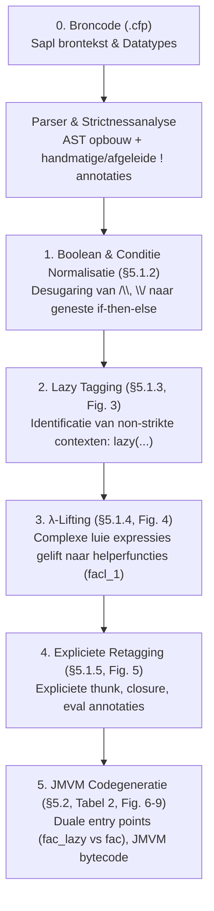

# Plan & Architectuur: Educatieve Visualisatie van de Sapl Compiler Pipeline

> **Doel:** Het inzichtelijk, interactief en stapsgewijs visualiseren van de interne transformaties van de Sapl-compiler in de WebSapl web-IDE voor educatieve en onderzoeksdoeleinden.
> 
> **Theoretische basis:** *A Portable VM-based implementation Platform for non-strict Functional Programming Languages* (Jan Martin Jansen & John van Groningen, IFL 2016, `docs/main.pdf`).

---

## 1. Inleiding & Filosofie

De kernfilosofie van de Sapl-naar-JMVM compiler is:
> *"Behandel het programma zoveel mogelijk alsof het een strikte taal is, en wijk hier alleen expliciet van af op plekken waar non-strictness (luiheid) vereist is."*

Om dit te bereiken voert de compiler een reeks broncode-naar-broncode (source-to-source) transformaties uit over de abstracte syntaxboom (AST). Aan het einde van deze transformaties zijn alle runtime-mechanismen voor luiheid (**thunk-creatie**, **closure-creatie**, en **evaluatie**) volledig expliciet gemaakt. Hierdoor kan de uiteindelijke codegeneratie naar JMVM-machinecode eenvoudig en direct worden uitgevoerd.

In WebSapl willen we deze transformatieketen stap voor stap zichtbaar maken voor studenten en docenten.



---

## 2. De 5 Compilatiestappen in Detail

### Stap 0: Broncode & Abstracte Syntaxboom (AST)
- **Doel**: Inlezen van de brontekst en opbouwen van de initiële programmaboom bestaande uit functiedefinities (`Func`), argumenten (`Arg`), expressies (`Expr`) en algebraïsche datatypes (`Adt`).
- **Strictness-analyse**: Bepalen welke functieparameters strikt zijn (`!x` handmatig of automatisch afgeleid via `strictness.cfp`).

---

### Stap 1: Boolean & If-Normalisatie (*Paper §5.1.2*)
- **Doel**: Complexe logische expressies en voorwaarden omzetten naar een vorm die direct aansluit op de conditionele spronginstructies van de JMVM (`ifeq`, `ifneq`, `iflt`, `ifle`).
- **Transformaties**:
  - Conjuncties (`a /\ b`) worden herschreven naar geneste condities: `if a (if b True False) False`.
  - Disjuncties (`a \/ b`) worden herschreven naar: `if a True (if b True False)`.
  - Conditionele vertakkingen worden genormaliseerd naar canonieke 3-wegs `if cond then else`-vormen.

---

### Stap 2: Identificatie van Non-strikte Contexten & Lazy Tagging (*Paper §5.1.3, Figuur 3*)
- **Doel**: Nauwkeurig bepalen welke deeluitdrukkingen niet direct geëvalueerd mogen worden en dus 'lui' moeten blijven.
- **Regels voor `lazy(...)` markering**:
  1. Non-strikte argumenten van bekende functie-aanroepen.
  2. De rechterkant van non-strikte `let`-bindingen.
  3. Alle argumenten van onder-verzadigde aanroepen (partial applications).
  4. Alle argumenten van onbekende aanroepen (hogere-orde functies/variabelen).
  5. De over-verzadigde argumenten bij over-verzadigde aanroepen.
  6. Non-strikte velden bij constructor-aanroepen in ADT's.
- **Voorbeeld (`facl`)**:
  ```sapl
  facl n = if (n == 0) 1 (n * facl (lazy (n - 1)))
  ```

---

### Stap 3: $\lambda$-Lifting van Luie Sub-expressies (*Paper §5.1.4, Figuur 4*)
- **Doel**: Voorkomen dat de VM complexe grafen in het geheugen hoeft op te bouwen. Alleen functies kunnen als thunk worden gealloceerd. Daarom worden niet-triviale luie berekeningen gelift naar nieuwe top-level functies.
- **Lifting is NIET nodig voor**:
  - Literalen (getallen, karakters).
  - Variabelen.
  - Functie-aanroepen (deze zijn al functies).
  - Constructors met alleen non-strikte argumenten.
- **Lifting is WEL nodig voor**:
  - Complexe berekeningen (zoals `n - 1`), `case`-expressies, `if`-expressies in luie context.
- **Resultaat voor `facl`**:
  ```sapl
  facl n = if (n == 0) 1 (n * facl (lazy (facl_1 n)))
  facl_1 n = n - 1
  ```

---

### Stap 4: Expliciete Retagging naar Runtime-Operaties (*Paper §5.1.5, Figuur 5*)
- **Doel**: De abstracte `lazy(...)`-tags vertalen naar de exacte runtime-actie die op de JMVM-heap moet worden uitgevoerd.
- **Retagging-regels**:
  | Oorspronkelijke tag / Context | Nieuwe expliciete tag | Betekenis in runtime |
  | :--- | :--- | :--- |
  | `lazy(f as)` met verzadigde aanroep | `thunk (f as)` | Maakt een verzadigde thunk op de heap |
  | `lazy(...)` onder-/oververzadigd of onbekend | `closure (f as)` | Maakt een closure (functie + partiële argumenten) |
  | Ongetagde onder-verzadigde aanroep | `closure (f as)` | Maakt direct een closure |
  | Ongetagde over-verzadigde / onbekende aanroep | `eval (f as)` | Evalueert eerst de functie/closure |
  | Ongetagde non-strikte variabele | `eval x` | Dwingt evaluatie van de luie variabele af |
- **Resultaat voor `facl`**:
  ```sapl
  facl n = if (eval(n) == 0) 1 (eval(n) * facl (thunk (facl_1 n)))
  facl_1 n = eval(n) - 1
  ```

---

### Stap 5: JMVM Codegeneratie & Duale Entry Points (*Paper §5.2, Tabel 2, Figuur 6–9*)
- **Doel**: Directe vertaling van de geannoteerde AST naar lineaire JMVM-stackinstructies.
- **Duale Entry Points voor functies met strikte parameters (`!`)**:
  - **Strict Entry Point**: Voor directe aanroepen waar argumenten reeds geëvalueerd op de stack liggen (maximale snelheid).
  - **Lazy Entry Point**: Voor aanroepen via thunks of evaluaties waar argumenten eerst met `eval` geëvalueerd en opgeslagen moeten worden.
- **Resultaat voor `fac` (strikt)**:
  ```
  fac_lazy: load 0
            eval
            store 0
  fac:      load 0
            ifneq L1
            return_const 1 1
  L1:       load 0
            loadadd 0 -1
            call fac
            mult
            return 1
  ```

---

## 3. De 4 Kernvoorbeelden uit het Paper

In de educatieve weergave worden de vier kernvoorbeelden uit het paper als standaard keuzes aangeboden:

1. **`facl` (Non-strict Factorial)**:
   - Illustreert: `lazy`-tagging, $\lambda$-lifting van `(n - 1)` naar `facl_1`, thunk-creatie en `eval(n)`.
2. **`fac` (Strict Factorial - `fac !n`)**:
   - Illustreert: Geen lifting nodig, minimale overhead, dual entry points in bytecode.
3. **`twice` & `twicex` (Hogere-orde functies)**:
   - Illustreert: `closure`-vorming voor partiële functieparameters en evaluatie via `eval`.
4. **`sieve` (Zeef van Eratosthenes)**:
   - Illustreert: Luie oneindige lijsten, case-evaluatie (`case (eval xs)`), en interactie tussen constructors en thunks.

---

## 4. Technische Architectuur in WebSapl

### A. Compiler Backend (`sapl_compiler/`)
Om de tussenstappen te exporteren zonder de compiler te vertragen:
1. **AST Pretty-Printer (`pprint.cfp`)**:
   - Een module met functies `ppProg`, `ppFunc`, `ppExpr` die een AST getrouw terugvertaalt naar geannoteerde Sapl-syntax met keywords `lazy(...)`, `thunk(...)`, `closure(...)`, `eval(...)`.
2. **Multi-Stage Compiler Driver**:
   - Een functie `compileAllStages` in `driver.cfp` die de pipeline doorloopt en een gestructureerde lijst oplevert:
     ```
     [ StageResult "0_source"  sourceText
     , StageResult "1_bool"    stage1PrettyText
     , StageResult "2_lazy"    stage2PrettyText
     , StageResult "3_lift"    stage3PrettyText
     , StageResult "4_retag"   stage4PrettyText
     , StageResult "5_jmvm"    stage5BytecodeText
     ]
     ```
3. **WASM Interface**:
   - Uitbreiding van `worker.js` met het bericht `COMPILE_STAGES`.

---

### B. Frontend UI & Educatieve User Experience

De WebSapl interface wordt uitgebreid met een derde viewmodus in de header:

```
[📝 Editor]   [🔬 Compiler Pipeline]   [⚡ Benchmarks]
```

In de **🔬 Compiler Pipeline View**:

```
+-----------------------------------------------------------------------------------------+
| [0. Broncode] ➔ [1. Booleans] ➔ [2. Lazy Tagging] ➔ [3. λ-Lifting] ➔ [4. Annotaties] ➔ [5. Bytecode] |
+-----------------------------------------------------------------------------------------+
| [ Voorbeeld laden: facl (non-strict) v ]          [ Toon Verschil met Vorige Stap: [x] ] |
+----------------------------------------------------+------------------------------------+
|  LINKER PANEEL (Code van gekozen stadium)         |  RECHTER PANEEL (Toelichting & Paper) |
|                                                    |                                    |
|  facl n = if (eval(n) == 0)                       |  📖 Stap 4: Expliciete Retagging   |
|             1                                      |  Paper Sectie: §5.1.5 (Figuur 5)   |
|             (eval(n) * facl (thunk (facl_1 n)))   |                                    |
|                                                    |  Wat gebeurt hier?                 |
|  facl_1 n = eval(n) - 1                            |  • facl_1 n is een verzadigde     |
|                                                    |    aanroep in een luie context,    |
|                                                    |    dus dit wordt een 'thunk'.      |
|                                                    |  • De parameter n is niet strikt   |
|                                                    |    gemarkeerd, dus evaluatie wordt |
|                                                    |    afgedwongen via 'eval(n)'.      |
|                                                    |                                    |
|                                                    |  VM Impact:                        |
|                                                    |  Bij executie wordt een thunk-cel  |
|                                                    |  op de heap gealloceerd (create 2).|
+----------------------------------------------------+------------------------------------+
```

### Belangrijkste UI-Functionaliteiten:
1. **Interactieve Stepper**: Eén klik op een fase springt direct naar de code en uitleg van die fase.
2. **Side-by-Side Diff Modus**: Toont de code vóór en na de gekozen transformatiestap met gemarkeerde toevoegingen (bijvoorbeeld groen gearceerde `lazy(...)`-tags of de nieuwe `facl_1` functie).
3. **Syntax-highlighting voor geannoteerde keywords**: `lazy`, `thunk`, `closure`, `eval` krijgen herkenbare, heldere kleuren in zowel Light als Dark mode.
4. **Educatieve Annotaties**: Elke stap bevat directe citaten, theoretische onderbouwing en verwijzingen naar figuren/tabellen uit `main.pdf`.

---

## 5. Uitvoeringsplan in 4 Fasen

| Fase | Onderdeel | Werkzaamheden |
| :--- | :--- | :--- |
| **Fase 1** | **Compiler Backend & Pretty-Printer** | • Bouwen van `pprint.cfp` (AST $\rightarrow$ Sapl met `lazy`/`thunk`/`closure`/`eval`).<br>• Uitbreiden van `driver.cfp` met `compileAllStages`.<br>• Valideren met unit tests tegen de golden outputs van Fig. 2–9. |
| **Fase 2** | **Web Worker & WASM Integratie** | • Compileren van de geüpdatete `saplcomp.jmvm`.<br>• Inrichten van `COMPILE_STAGES` RPC in `websapl/engine/worker.js`. |
| **Fase 3** | **UI & Pipeline Visualizer** | • Bouwen van `websapl/js/pipeline_ui.js`.<br>• Implementeren van de horizontale stepper, CodeMirror viewers en stijlen in `websapl/css/app.css`. |
| **Fase 4** | **Educatieve Content & Diff View** | • Toevoegen van het informatieve toelichtingspaneel met paper-referenties.<br>• Implementeren van de side-by-side diff weergave.<br>• Integreren van de interactieve paper-voorbeelden (`facl`, `fac`, `twice`, `sieve`). |

---

*Dit document is opgeslagen als `websapl/COMPILER_PIPELINE_PLAN.md` zodat het altijd kan worden geraadpleegd en als leidraad dient voor de implementatie.*
